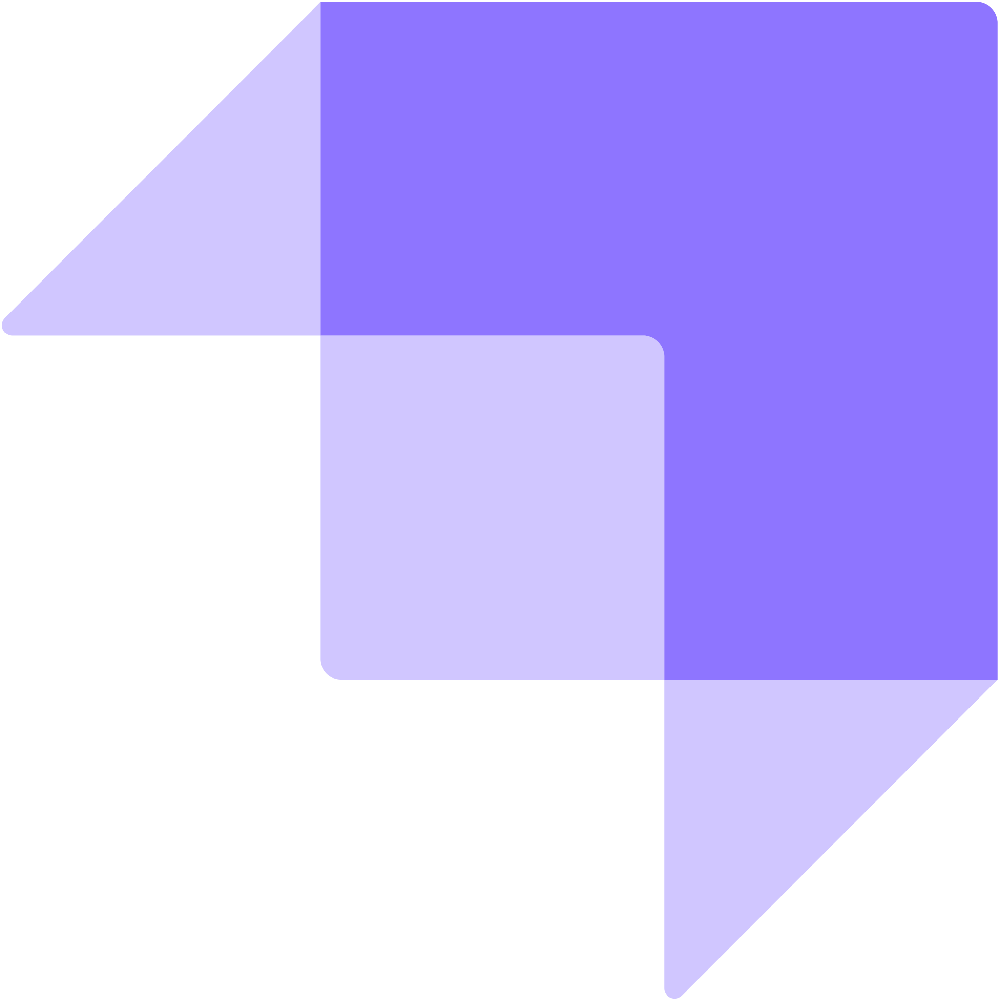

<h1 align="center"> Hello there! :wave: </h1>

 

 
 

<h2> Who am I? </h2>

 I am a passionate Fullstack software engineer and adept in bringing forth expertise in design, development, testing, and maintenance of software systems. A ReactJs and NextJs enthusiast and Javascript lover. I am always looking to expand my current knowledge and become better at my craft! :yum: 

 

<b>What I do?</b>

<ul>
  <li> Full-stack development </li>
  <li> Self Management </li>
  <li> Design UI on Adobe Xd </li>
</ul>

 

<b>Languages I know and Learning</b>
 
 
&nbsp;
&nbsp;
&nbsp;
&nbsp;
&nbsp;
&nbsp;
 
&nbsp;
&nbsp;
&nbsp;
&nbsp;
&nbsp;
&nbsp;
&nbsp;
&nbsp;
&nbsp;
&nbsp;
&nbsp;
&nbsp;
&nbsp;
&nbsp;
&nbsp;
&nbsp;
 

 I am great at working with Agile teams and avidly participating in code reviews and passionate about maintaining a healthy and fun relationship with
co-workers to further enhance the work environment for better productivity. I like having my hand in the system architecture design sessions and love
brainstorming ideas with others when trying to solve a problem. Love being around teams who know how to relax and know when it's time to get
serious and I enjoy being around individuals who can teach me to be better as an engineer. 

 

  

 
<h1>Contact me! :iphone:</h1>

 Checkout my website: https://portfolio-aetheryna.vercel.app/. Everything you need to know about my past experiences and projects, you can check it out if your interested! 

 

<!--
**AetheryNA/AetheryNA** is a ✨ _special_ ✨ repository because its `README.md` (this file) appears on your GitHub profile.

Here are some ideas to get you started:

- 🔭 I’m currently working on ...
- 🌱 I’m currently learning ...
- 👯 I’m looking to collaborate on ...
- 🤔 I’m looking for help with ...
- 💬 Ask me about ...
- 📫 How to reach me: ...
- 😄 Pronouns: ...
- ⚡ Fun fact: ...
-->
